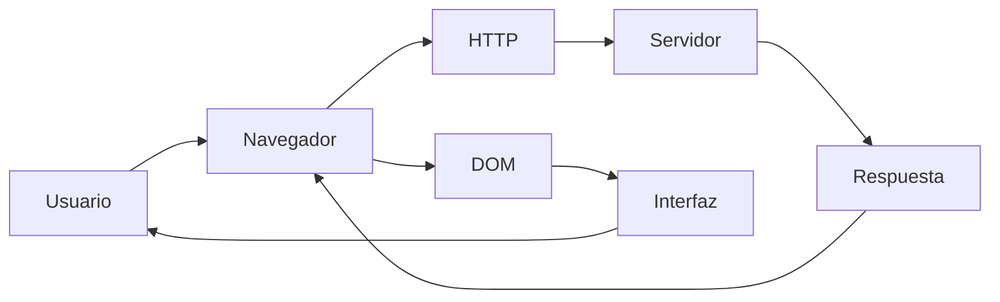
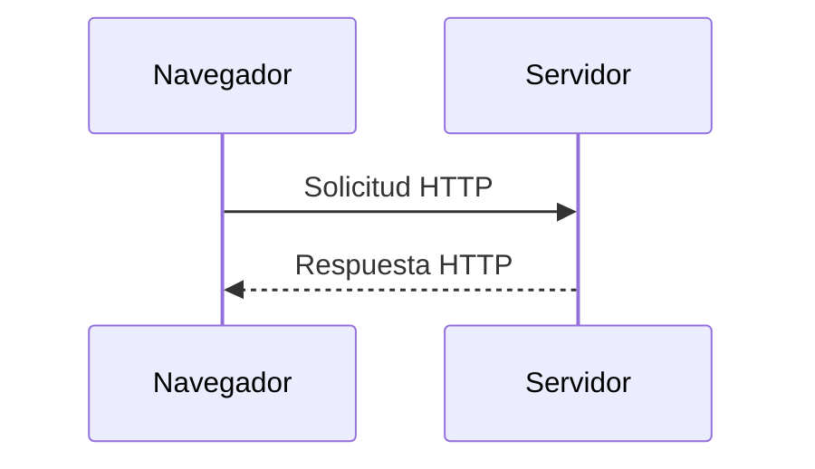
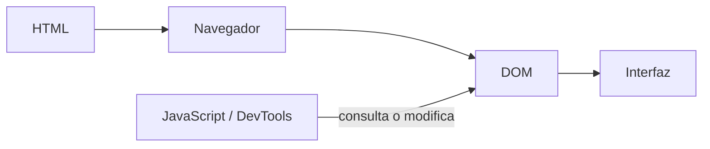
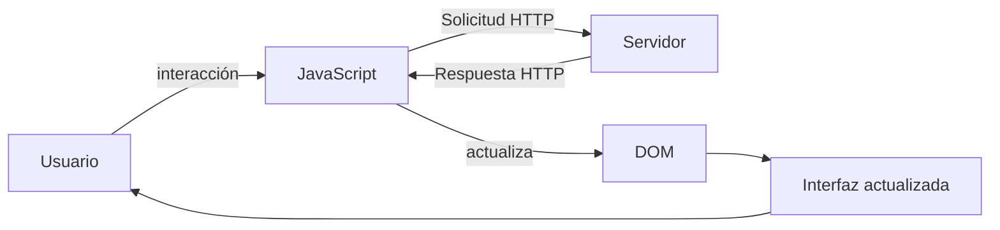
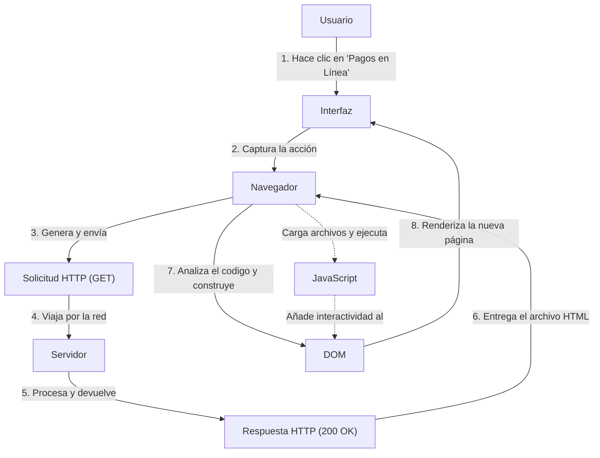

# Laboratorio 01 --- Análisis del funcionamiento de una aplicación web

> **Curso:** Aplicaciones y Servicios Web\
> **Modalidad:** Práctica de laboratorio\
> **Entrega:** Repositorio GitHub --- archivo `README.md`\
> **Evidencias:** Carpeta `evidencias/`

------------------------------------------------------------------------

## Objetivo de la práctica

Analizar el funcionamiento de una aplicación web real mediante las
herramientas de desarrollo del navegador, identificando los recursos
cargados, las solicitudes y respuestas HTTP, la estructura DOM y las
interacciones entre cliente y servidor.

## Resultado esperado

Al finalizar la práctica, el estudiante deberá poder reconstruir y
documentar el flujo observado entre:



> El diagrama anterior representa los **componentes que serán
> analizados**. El diagrama final de la práctica deberá ser construido
> por el estudiante a partir de sus propias observaciones.

------------------------------------------------------------------------

# 1. Preparación del entorno

1.  Ingrese a la aplicación web indicada por el docente.
2.  Abra las **herramientas de desarrollo** del navegador.
3.  Identifique las herramientas **Red / Network** y **Elementos /
    Elements**.
4.  Cree la siguiente estructura dentro del repositorio:

``` text
laboratorio-01/
├── README.md
└── evidencias/
```

El archivo `README.md` será el informe de la práctica. La carpeta
`evidencias/` contendrá las capturas utilizadas para sustentar los
resultados.

------------------------------------------------------------------------

# 2. Identificación de recursos de la aplicación

Abra la herramienta **Red / Network** y recargue completamente la
aplicación.

Observe las solicitudes generadas durante la carga e identifique como
mínimo **cinco recursos**, procurando seleccionar tipos diferentes:
documento HTML, CSS, JavaScript, imágenes, fuentes u otros.

## Resultados

Complete la tabla:

  Recurso   Tipo   Dominio     Tamaño
  --------- ------ --------- --------
  recurso: formatos-institucionales/
  Tipo: document                           
  Dominio: www.itm.edu.co                           
  Tamaño: 103KB                           
                             

**Total de solicitudes observadas:** `__88__`

## Evidencia

Guarde una captura de la pestaña Network como:

``` text
evidencias/network.png
```

Inclúyala aquí:

``` markdown

```

### Análisis

**¿Por qué una sola URL puede generar múltiples solicitudes HTTP?**

> Escriba aquí su respuesta.
Se producen multiples solicitudes porque uno solo no descarga la pagina completa en un solo bloque, esta la primera solicitud que es cuando damos ENTER, luego esta la lectura que es cuando el HTML llega y luego estan las solicitudes adicionales que serian como para mostrar los diseños, ya por ultimo estan los recursos externos que son mas solicitudes que llevan tipografia, estilos, imagenes,etc.
------------------------------------------------------------------------

# 3. Análisis de una solicitud HTTP

En **Network**, seleccione una de las solicitudes realizadas por el
navegador, preferiblemente la correspondiente al documento principal.

Identifique la información solicitada a continuación.

  Elemento              Resultado
  --------------------- -----------
  URL :  https://www.itm.edu.co/formatos-institucionales/                
  Método HTTP : GET          
  Código de estado :200 OK    
  Host / dominio: www.itm.edu.co        
  Tipo de recurso: text/html       
  Tiempo de respuesta: 2:30s   

## Flujo que se está observando



## Evidencia

Guarde una captura de los detalles de la solicitud como:

``` text
evidencias/request.png
```

Inclúyala en el informe:

``` markdown

```

### Análisis

**¿Qué recurso solicitó el navegador?**

> Esta solicitando el documento HTML principal osea la estructura base de la pagina

**¿Qué información permite determinar si la solicitud fue atendida
correctamente?**

> Se sabe si fue atendida correctamente con el codigo de estado que es el 200 OK

------------------------------------------------------------------------

# 4. Inspección del DOM

Seleccione un elemento visible de la aplicación, por ejemplo:

-   un botón;
-   un título;
-   un enlace;
-   un campo de formulario;
-   un elemento del menú.

Utilizando **Elementos / Elements**:

1.  Localice el elemento dentro del DOM.
2.  Identifique la etiqueta HTML utilizada.
3.  Modifique temporalmente su contenido desde las herramientas de
    desarrollo.
4.  Observe el cambio producido en la interfaz.
5.  Registre la evidencia.

## Resultados

**Elemento seleccionado:** `Boton Descargar`

**Etiqueta HTML:** `La etiqueta del inicio <a> significa anchor`

**Contenido original:** `La palabra Descargar`

**Modificación realizada:** `La frase: Hola mundo :D`

El proceso observado puede representarse conceptualmente así:



## Evidencia

Guarde la captura como:

``` text
evidencias/dom.png
```

Inclúyala aquí:

``` markdown

```

### Análisis

**¿La modificación realizada sobre el DOM alteró permanentemente la
aplicación o los archivos almacenados en el servidor? Justifique.**

> Escriba aquí su respuesta.
No porque cuando se entra a una URL, el servidor web del itm envia a nuestros navegadores una copia del archivo HTML original, el DOM es temporal y la comunicacion es unidireccional, como clientes solo tenemos los permisos para hacer solicitudes HTTP GET para leer la pagina
------------------------------------------------------------------------

# 5. Análisis de una interacción dinámica

Regrese a **Network** y limpie las solicitudes registradas.

Realice una acción dentro de la aplicación que pueda generar una
interacción con el servidor, por ejemplo:

-   consultar;
-   buscar;
-   filtrar;
-   seleccionar una opción;
-   enviar información.

Observe si aparece una nueva solicitud en Network.

## Resultados

  Elemento                       Resultado
  ------------------------------ -----------
  Acción realizada: Seleccion de laa opcion "Pagos en linea"               
  ¿Generó una nueva solicitud?: Si, genero la solicitud de "pagos-en-linea/"  
  URL solicitada: https://www.itm.edu.co/pagos-en-linea/                 
  Método HTTP: GET                    
  Código de estado: 200 OK               
  Tipo de respuesta: text/HTML              

## Ciclo de interacción

Utilice este esquema únicamente como referencia conceptual para
interpretar lo observado:



## Evidencia

Guarde la captura como:

``` text
evidencias/interaccion.png
```

Inclúyala aquí:

``` markdown

```

### Análisis

**Explique la relación entre la acción realizada por el usuario y la
solicitud observada.**

> La relacion entre ambas es una directa causa y efecto, la causa es la interaccion del usuario al hacer click en "Pagos en linea" se interactuo con un un elemento de la interfaz que tenia una etiqueta HTML de enlace, el navegador entendio ese click y supo que se queria cambiar de seccion, el efecto es la solicitud HTTP que automaticamente el navegador construyo y envio la solicitud que se vio en network, y ya el resultado es que se encontro el archivo correcto y se vio un estado de exito que es el 200 OK

------------------------------------------------------------------------

# 6. Reconstrucción del flujo observado

A partir de **sus propias evidencias**, construya un diagrama Mermaid
que represente el funcionamiento de la aplicación analizada.

El diagrama deberá incluir, cuando corresponda:

`Usuario` · `Navegador` · `JavaScript` · `Solicitud HTTP` · `Servidor` ·
`Respuesta HTTP` · `DOM` · `Interfaz`

> **No copie los diagramas anteriores.** Esta sección debe representar
> el flujo que usted pudo comprobar durante la práctica.

Reemplace el siguiente bloque con su diagrama:



------------------------------------------------------------------------

# 7. Observado vs. inferido

Una herramienta de desarrollo permite observar una parte del sistema,
pero no necesariamente todo lo que ocurre en el servidor.

Clasifique sus hallazgos:

## Elementos observados directamente

-   
-   
-   

## Elementos inferidos

-   
-   
-   

> No presente como observado un proceso interno que las herramientas del
> navegador no permitan comprobar directamente.

------------------------------------------------------------------------

# 8. Conclusiones

Redacte **tres conclusiones técnicas** derivadas de la práctica.

1.  
2.  
3.  

Las conclusiones deben explicar lo aprendido a partir de la evidencia y
no limitarse a describir las actividades realizadas.

------------------------------------------------------------------------

# 9. Entrega

La estructura final esperada es:

``` text
laboratorio-01/
├── README.md
└── evidencias/
    ├── network.png
    ├── request.png
    ├── dom.png
    └── interaccion.png
```

Antes de entregar, verifique:

-   [ ] El `README.md` se visualiza correctamente en GitHub.
-   [ ] Las imágenes se muestran dentro del README.
-   [ ] Se documentaron al menos cinco recursos.
-   [ ] Se analizó una solicitud HTTP.
-   [ ] Se identificó y modificó un elemento del DOM.
-   [ ] Se analizó una interacción de la aplicación.
-   [ ] El diagrama final corresponde a lo observado.
-   [ ] Se diferenciaron elementos observados e inferidos.
-   [ ] Se redactaron tres conclusiones técnicas.
-   [ ] Se realizó `commit` y `push` al repositorio.

------------------------------------------------------------------------

## Criterio de documentación

> **Las capturas son evidencia, no la respuesta.**

Cada evidencia debe estar acompañada por una explicación que indique
**qué se observó, qué significa y cómo se relaciona con el
funcionamiento de la aplicación web**.
